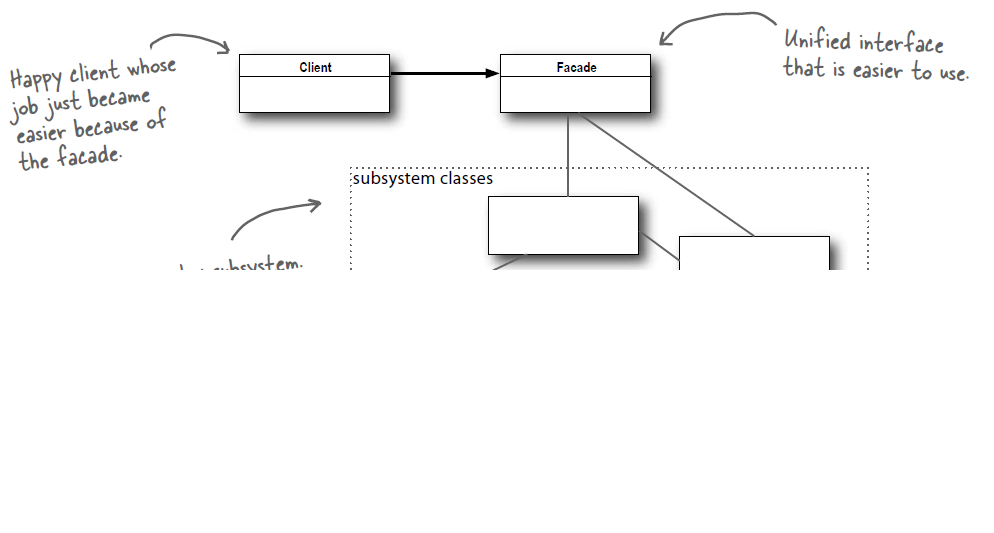

# 设计模式学习

学习设计模式，重点在于理解类和接口所扮演的“角色”，而不是盯着代码本身。

## 面向对象设计原则

### 单一职责原则

- 定义：一个对象应该只包含单一的职责，并且该职责被完整地封装在一个类中。

- 解读：单一职责原则用来控制类的粒度大小。一个类（大到模块，小到方法）承担的职责越多，它被复用的可能性就越小，而且一个类承担的职责过多，相当于将这些职责耦合在一起，当其中一个职责变化时可能会影响其他职责运作，因此需要将这些职责分离。

  **单一职责原则时实现高内聚、低耦合的指导方针**，需要开发人员发现类的不同职责，并将其分离。

### 开闭原则

- 定义：软件实体应当对扩展开放，对修改关闭。

- 解读：开闭原则就是指在软件实体应**尽量在不修改原有代码的情况下进行扩展**。

  如果一个软件设计符合开闭原则，那么在扩展时无须修改现有代码，使得软件在拥有适应性和灵活性的同时具备较好的稳定性和延续性。

  为了满足开闭原则，需要对系统进行抽象化设计，**抽象化是开闭原则的关键**。可以通过定义系统的抽象层，再通过具体类来进行扩展。如果需要修改系统的行为，无须对抽象层进行修改，只要增加新的具体类来实现新功能即可，实现在不修改已有代码的基础上扩展系统的功能，达到开闭原则。

### 里氏代换原则

- 定义：所有引用基类的地方必须能透明地使用其子类的对象。
- 解读：里氏代换原则时实现开闭原则的重要方式之一，在程序中应尽量**使用基类类型来对对象进行定义**，在而运行时再确定其子类类型，用子类对象来替换父类对象。

### 依赖倒转原则

- 定义：高层模块不应该依赖低层模块，他们都应该依赖抽象。抽象不应该细节，细节应该依赖抽象。

- 解读：简单来首，**依赖倒转原则要求面向接口编程，不要面向实现编程**。

  应该使用接口和抽象类进行变量声明、参数类型声明、方法返回类型声明，以及数据类型转换，而不要用具体类来做这些事情。

  一个类应当只实现接口或抽象类中声明过的方法，而不要给出多余的方法，否则将无法调用到子类中增加的新方法。

- 依赖注入：当一个对象要与其他对象发生依赖关系时采用抽象的形式来注入依赖的对象。

  - 构造注入：通过构造方法传入具体类的对象。
  - 设值注入：通过Setter方法注入具体类的对象。
  - 接口注入：通过在接口声明的业务方法来传入具体类的对象。

  在重构的过程中，一般会同时使用开闭原则、里氏代换原则、依赖倒转原则，**开闭原则是目标，里氏代换原则是基础，依赖倒转原则是手段**。

### 接口隔离原则

- 定义：**客户端不应该依赖那些它不需要的接口**。

- 解读：当一个接口太大时需要将它分割成一些更细小的接口，每一个接口应该承担一个相对独立的角色。

  如果把接口理解为一个类型所提供所有方法特征的集合，即逻辑上概念，接口可以理解为角色，也叫“角色隔离原则”。

  如果把接口理解为特定语言（如Java）接口，应当为客户端提供尽可能小的接口，而不要提供大的总接口。；接口应该尽量细化，也要职责单一，同时接口中的方法应该尽量少，每个接口中只包含一个客户端所需的方法即可。这种机制也称为“定制服务”，即为不同的客户端提供宽窄不同的接口。

### 合成复用原则

- 定义：优先使用对象组合，而不是通过继承来达到复用的目的。

- 解读：在复用时，**尽量使用组合/聚合关系（关联关系），少用继承**。

  面向对象中可以通过2种方法在不同的环境中复用已有的设计和实现，即通过组合/聚合关系和通过继承，但首先应该考虑使用组合/聚合，组合/聚合可以使系统更加灵活，降低类与类之间的耦合度。

### 迪米特法则

- 定义：每一个软件单位对其他单位都只有最少知识，而且局限于那些与本单位密切相关的软件单位。也被称为**最少知识原则**。

- 解读：迪米特法则要求设计系统时应该尽量减少对象之间的交互，如果两个对象之间不必彼此直接通信，那么这两个对象就不应当发生任何直接的相互作用

  如果其中一个对象需要调用另一个对象的方法，可以通过“第三者”转发这个调用。简而言之，就是通过引入一个合理的“第三者”来降低现有对象之间的耦合度。

## 创建型模式

**将对象的创建和使用分离**，让用户再使用对象时无需关注对象的创建细节，**从而降低系统的耦合度**，让设计方案更易于修改和扩展。

### 简单工厂模式

- 定义

  定义一个工厂类，它可以根据参数的不同返回不同类的实例，被创建的实例通常具有共同的父类。

- 结构


- 实现

- 优点
  - 对象的创建和使用分离
  - 客户端无需知道所创建的具体产品的类的类名，只需要知道具体产品类所对应的参数即可，减少使用者的记忆量
  - 通过引入配置文件，可以在不修改客户端的情况下替换和增加新的具体产品类，提高了系统的灵活性。
  
- 缺点
  - **工厂类集中了所有产品的创建逻辑，职责过重**，一旦不能正常工作，整个系统都要受到影响。
  - 增加了系统中类的个数，增加了系统的复杂度和理解难度。
  - **系统扩展困难，产品类型较多时有可能造成工厂逻辑过于复杂**，不利于系统的扩展和维护。
  - 简单工厂模式由于使用了静态工厂方法，造成工厂角色无法形成基于继承的等级结构。
  
- 适用环境
  - **工厂类负责创建的类比较少**。
  
  - 客户端只知道传入工厂类的参数，**对于如何创建对象并不关心**。
  
    

### 工厂方法模式

工厂方法模式是简单工厂模式的延伸，简单工厂模式中工厂类负责所有产品的创建，职责过重，产品类型过多时工厂类逻辑过于复杂；新增产品时，需要修改工厂类逻辑，不符合开闭原则。而工厂方法模式，更好地符合开闭原则，在增加新产品时，不需要对已有系统做修改。

- 定义

  定义一个用于创建对象的接口，但是让子类决定将哪个一个类实例化。**工厂方法模式让一个类的实例化延迟到其子类**。

- 结构

  

- 实现

- 优点

  - **用户只需关心所需产品对应的工厂**，无需关心创建细节，甚至无须知道具体产品类的名称。（和简单工厂相比，简单工厂只需要关心创建产品对应的参数）
  - **基于工厂角色和产品角色的多态性设计是工厂方法模式的关键**。它能够让工厂自主确定创建何种产品对象，而如何创建这个对象的细节完全封装在具体工厂内部。**工厂方法模式之所以又被称为多态工厂模式**，正式因为所有的具体工厂类都具有同一抽象父类。
  - 在系统中加入新产品时无须修改抽象工厂和抽象产品提供的接口，无须修改客户端，无须修改其他的具体工厂和具体产品，**只要添加一个具体工厂和具体产品即可**，系统的扩展性变得非常好，完全**符合开闭原则**。

- 缺点

  - 新增产品时需要新增具体产品类和与之对应的具体工厂类，系统中类的个数将成对增加，一定程度上增加了系统的复杂度。
  - 由于考虑到系统的可扩展性，需要引入抽象层，在客户端代码中均使用抽象层进行定义，增加了系统的抽象性和理解难度。

- 适用环境

  - 客户端不知道它所需要的对象的类。只需要知道对应的工厂即可。具体产品对象的创建由具体工厂类创建，可以将具体工厂类的类名保存在配置文件中。
  - 抽象工厂类通过其子类来指定创建哪个对象。对于抽象工厂类只需要提供一个创建产品的接口，而由其子类来确定创建哪个具体产品对象，利用面向对象的多态性和里氏代换原则，在程序运行时子类对象将覆盖父类对象，从而使得系统更容易扩展。


### 抽象工厂模式

在工厂方法模式中，每个具体的工厂只能生产一种具体的产品，但是在抽象工厂模式中一个具体的工厂可以生产一组相关的具体产品，这一组产品称为产品族，产品族中的每一个产品都分属于某一个产品继承等级结构。

工厂方法模式针对的是一个产品等级，而抽象工厂模式面对多个产品等级结构。

产品等级结构：产品的继承结构。

产品族：同一个工厂生产的位于不同产品等级结构中的一组产品。

- 定义

  提供一个创建一系列相关或相互依赖对象的接口，而无需指定它们具体的类。

- 结构

  

- 实现

- 优点

  - 抽象工厂模式隔离了具体类的生成，使得客户端并不知道什么被创建。所有的具体工厂都实现了抽象工厂定义的公共接口，因此只需要改变具体工厂的实例就可以在某种程度上改变整个软件系统的行为。
  - 当一个产品族中的多个对象被设计成一起工作时，它能够保证客户端始终只使用如同一个产品族的对象。
  - 增加新的产品族很方便，无须修改已有系统，符合开闭原则。

- 缺点

  增加产品等级结构麻烦，需要对原有系统进行较大的修改，甚至需要修改抽象层代码，违背了开闭原则。

  比如再增加一个产品C，则需要修改所有工厂角色，包括抽象工厂类。

- 适用环境

  Java语言的AWT（抽象窗口工具包）中就使用了抽象工厂模式。
  
  比如皮肤包换肤。
  
  - 一个系统不应该依赖于产品实例如何被创建、组合和表达细节。
  - 系统中有多余一个的产品族，而每次只使用其中某一个产品族。
  - 属于同一个产品族的产品将在一起使用，这一约束必须在系统的设计中体现出来。
  - 产品等级结构稳定，在设计完成之后不会想系统中增加新的产品等级结构或者删除已有的产品等级结构。


### 建造者模式

- 定义

  将一个复杂对象的构建与它的表示分离，使得同样的构建过程可以创建不同的表示。

  复杂对象简单来说就是包含多个成员变量的对象。

- 结构

  

- 实现

  - 省略Director

    一般为了简化系统结构，会将指挥者Director和抽象建造者Builder进行合并。

  - 钩子方法引入

    用于精细化控制某个部分是否被创建。

- 优点

- 缺点

- 适用环境

  创建复杂对象。


### 原型模式

- 定义

  使用原型实例指定待创建对象的类型，并通过复制这个原型来创建新的对象。

  **通过克隆复制一个对象。**

- 结构

  

- 实现

  Java语言中可以直接用Object.clone实现浅克隆。

  Java语言中可以通过序列化实现深克隆。通过序列化将对象写到流中，再从流中读取出来，可以实现深克隆。

- 优点

- 缺点

- 适用环境

​	

### 单例模型

- 定义

  顾名思义，系统中全局只有一个实例。确保一个类只有一个实例，并提供一个全局访问点来访问这个唯一实例。

- 结构

- 实现

  - 饿汉单例

    使用静态内部变量，在类加载时对象创建，从而保证只有一个实例。

  - 懒汉单例

    双重检查锁定。

  - 静态内部类实现单例（Java 语言技术特有）

    ```java
    public class Singleton {
    
        private Singleton() {
        }
    
        private static class SingletonHolder {
            private static final Singleton INSTANCE = new Singleton();
        }
    
        public static Singleton getUniqueInstance() {
            return SingletonHolder.INSTANCE;
        }
    }
    ```

- 优点

- 缺点

- 适用环境

## 结构型模式

结构型模式关注**如何将现有类或对象组织在一起形成更强大的结构**。不同的结构模型从不同的角度来组合类或者对象，尽可能满足面向对象设计原则的同时为类或者对象的组合提供一些列巧妙地解决方案。

### 适配器模式

- 定义

  将一个类的接口转换成客户希望的另一个接口。适配器模式让那些接口不兼容的类可以一起工作。

- 结构

  

- 实现

- 优点

  - 将目标类和适配类解耦。
  - 增加了类的透明性和复用性，将具体的业务实现过程封装在是陪着列中，对于客户端类而言时透明的，二期提高了适配的复用性，同一个是陪着类可以在多个不同的系统中复用。
  - 灵活性和扩展性非常好，可以在不修改原有代码的基础上增加新的适配器类，完全符合开闭原则。

- 缺点

- 适用环境

  - 系统需要使用一些现有的类，而这些类的接口不符合系统的需要。
  - 想创建一个可以重复使用的类，用于和一些 彼此间在济南没有太大关联的类一起工作。

### 桥接模式

如果系统中的某个类存在2个独立变化的维度，通过桥接模式可以将这两个维度分离出来，时两者可以独立扩展。

桥接模式用一种巧妙的方式处理多层继承存在的问题，用抽象关联来取代传统的多层继承，将类之间的静态继承关系转换为动态的对象组合关系，使得系统更加灵活，并易于扩展，同时有效地控制了系统中类的个数。

- 定义

  将抽象部分与它的实现部分解耦，使得两者都能够独立变化。

  桥接模式又称为柄体模式（handler and Body）或者接口模式（Interface）。

- 结构

  

- 实现

  如JDBC。

- 优点

  - 分离抽象接口及其实现部分。使用“对象见得关联关系”解耦了抽象和实现之间的固有绑定关系，使得抽象和实现可以沿着各自的维度变化。
  - 桥接模式可以取到多层继承方案，多层继承违背了单一职责原则，复用性较差。桥接模式极大的减少了子类个数。
  - 提高了系统的可扩展性，在两个变化维度中任意扩展一个维度都需要修改原有系统，符合开闭原则。

- 缺点

  - 桥接模式增加系统的理解与设计难度，由于关联关系建立在抽象层，要求开发者一开始就针对抽象层进行设计与编程。
  - 桥接模式要求正确地识别系统中两个独立变化的维度，使用范围具有一定的局限性。

- 适用环境

  - 一个类存在两个（或多个）独立变化的维度，且这两个（或多个）维度都需要独立进行扩展。

### 组合模式

- 定义

  组合多个对象形成树形结构以小时具有部分-整体关系的层次结构。组合模式让客户单可以统一对待单个对象和组合对象。

  组合模式又称为部分-整体模式（Part-Whole），它将对象组织到树形结构中，可以用来描述整体与部分的关系。

- 结构

  组件（Component）类是组合类（Composite）和叶子类（Leaf）的父类，可以把组合类看成是树的中间节点。

  组合对象拥有一个或者多个组件对象，因此组合对象的操作可以委托给组件对象去处理，而组件对象可以是另一个组合对象或者叶子对象。

  

- 实现

  比如android中的View和ViewGroup。

  java.awt.Container#add(Component)

  java.util.Map#putAll(Map)

  java.util.List#addAll(Collection)

  java.util.Set#addAll(Collection)

- 优点

- 缺点

- 适用环境

  - **在具有整体和部分的层次结构中希望通过一种方式忽略整体与部分的差异，客户端可以一致地对待他们。**

  - **系统中需要处理一个树形结构。**
  - **系统中能够分离出叶子对象和容器对象。**

### 装饰模式

- 定义

  动态地给一个对象增加一些额外的职责。就扩展功能而言，装饰模式提供一个中比使用子类更加灵活的替代方案。

- 结构

  **装饰者（Decorator）和具体组件（ConcreteComponent）都继承自组件（Component）**，具体组件的方法实现不需要依赖于其它对象，而装饰者组合了一个组件，这样它可以装饰其它装饰者或者具体组件。所谓装饰，就是把这个装饰者套在被装饰者之上，从而动态扩展被装饰者的功能。装饰者的方法有一部分是自己的，这属于它的功能，然后调用被装饰者的方法实现，从而也保留了被装饰者的功能。可以看到，具体组件应当是装饰层次的最低层，因为只有具体组件的方法实现不需要依赖于其它对象。

  

- 实现

- 优点

  - 对于扩展一个功能，装饰模式比继承更加灵活，不会导致类的个数急剧增加。
  - 可以通过一种动态地方式来扩展一个对象的功能。
  - 可以对一个对象进行多次装饰，通过使用不同的具体装饰类以及这些装饰类的排列组合可以创造出很多不同行为的组合，得到更加强大的对象。
  - 具体构建类与具体装饰类可以独立变化，用户可以根据需要增加新的具体构建类和具体装饰类，原有类库代码无需改变，符合开闭原则。

- 缺点

  - 产生很多小对象。
  - 灵活机动的同时，也意味着更加容易出错，排错也更加困难，对于多次装饰的对象，在排错时需要逐级排查，较为繁琐。

- 适用环境

  - 在不影响其他对象的情况下，以动态、透明的方式给单个对象添加职责。
  - 不能采用继承的方式对系统进行扩展或者采用继承不利于系统扩展和维护时。不能采用继承有两类情况
    - 一是系统中存在大量独立的扩展，为支持每一种扩展或者扩展之间的组合产生大量的子类。
    - 二是类已经定义为不能继承，如Java中final关键系。

### 外观模式

满足迪米特法则，即最少知识原则。只和你的密友谈话。

- 定义

  为子系统中的一组接口提供一个统一的入口。外观模式顶一个了一个接高层接口，这个接口使得这一子系统更加容易使用。

- 结构

  

- 实现

- 优点

- 缺点

- 适用环境

### 享元模式

通过共享技术实现相同或相似的细粒度对象的复用，从而节约了内存空间，提高了系统性能。

- 定义

  运用共享技术地支撑大量细粒度对象的复用。

- 结构

  

- 实现

- 优点

- 缺点

- 适用环境

  - 一个系统中有大量相同或者相似的对象，造成内存的大量耗费。
  - 对象的大部分状态都可以外部化，可以将这些外部状态传入对象中。
  - 使用享元模式需要维护一个存储享元对象的享元池，因此应当在需要多次重复使用享元对象时才使用享元模式。

### 代理模式

- 定义

  给一个对象提供个代理或者占位符，并由代理对象来控制对原对象的访问。

- 结构

  - 远程代理（Remote Proxy）：控制对远程对象（不同地址空间）的访问，它负责将请求及其参数进行编码，并向不同地址空间中的对象发送已经编码的请求。（如Java 中RMI，远程方法调用）
  - 虚拟代理（Virtual Proxy）：根据需要创建开销很大的对象，它可以缓存实体的附加信息，以便延迟对它的访问，例如在网站加载一个很大图片时，不能马上完成，可以用虚拟代理缓存图片的大小信息，然后生成一张临时图片代替原始图片。
  - 保护代理（Protection Proxy）：按权限控制对象的访问，它负责检查调用者是否具有实现一个请求所必须的访问权限。
  - 智能代理（Smart Reference）：取代了简单的指针，它在访问对象时执行一些附加操作：记录对象的引用次数；当第一次引用一个对象时，将它装入内存；在访问一个实际对象前，检查是否已经锁定了它，以确保其它对象不能改变它。

  

- 实现

  Java 动态代理

  - 静态代理

    代理类和真实主题都是事先存在的，代理类的接口和代理方法都已经明确指定，每个一个代理类在编译之后都会生成一个class，dialing类所实现的接口和代理方法都被固定，这种代理称为静态代理。

  - 动态代理

    可以让系统在运行时根据实际需要来动态创建代理类，让同一个代理类能够代理多个不提供的真实主题类而且代理不同的方法。

  JDK提供的动态代理只能代理一个或多个就饿口，如果需要动态代理具体类或抽象类，可以使用CGLib（Code Generation Libaray）等工具。

- 优点

  - 能够协调调用者和被调用者，降低了系统的耦合度。
  - 客户端可以针对抽象主题角色进行编程，增加和替换代理了无须修改源代码，符合开闭原则，洗头工具有较好的灵活性和可扩展性。

- 缺点

  - 实现过程较为复杂。

- 适用环境

## 行为型模式

行为型模式**关注系统中对象之间的交互**，研究系统在运行时对象之间的相互通信与协作，进一步明确对象的职责。行为型模式不仅仅关注类和对象本身，还重点关注他们之间的相互作用和职责划分。

### 职责链模式

- 定义

  避免将一个请求的发送者与接收者耦合在一起，让对个对象都有机会处理请求。将接受请求的对象连接成一条链，并且沿着这条链传递请求，直到有一个对象能够处理它为止。

- 结构

  

- 实现

  ```java
  public abstract class Handler {
  
  	// 维持对下家的引用
      protected Handler successor;
  
  
      public Handler(Handler successor) {
          this.successor = successor;
      }
  
  
      protected abstract void handleRequest(Request request);
  }
  ```

  ```java
  public class ConcreteHandler extends Handler {
  
      public ConcreteHandler1(Handler successor) {
          super(successor);
      }
  
  
      @Override
      protected void handleRequest(Request request) {
          if (请求满足条件) {
              // 处理请求
          } else {
              this.successor.handleRequest(request);
          }
      }
  }
  ```

  ```java
  public class Client {
  
      public static void main(String[] args) {
  
          Handler handler1 = new ConcreteHandler1();
          Handler handler2 = new ConcreteHandler2();
          Handler handler3 = new ConcreteHandler3();
          
          // 创建职责链
          handler1.setSuccessor(handler2);
          handler2.setSuccessor(handler3);
          
          // 发送请求，情趣对象通常为自定义数据
          Request request = new Request();
          handler1.handleRequest(request);
      }
  }
  ```

- 优点

  - 使得一个对象无须知道时其他哪个对象处理请求，对象仅需知道该请求会被处理即可；链中的对象不需要知道链的结构，由客户端负责链的创建，降低了系统的耦合度。
  - 请求处理对象仅需要维持一个后继者的引用，简化对象之间的相互连接。
  - 增加一个新的具体请求处理者时无须修改原有系统代码，仅需在客户端重新建链即可，符合开闭原则。

- 缺点

  - 由于一个请求没有明确的处理者，不能保证一定会被处理，也有可能因为职责链没有正确配置而得不到处理。
  - 职责链较长时，代码调试时不方便。
  - 如果建链不当，会造成死循环。

- 适用环境

- 典型应用

  - Web开发中创建多个过滤器Filter链来对请求进行过滤
  - Java的异常处理机制

### 命令模式

- 定义

  将一个请求封装为一个对象，从而可用不同的请求对客户进行参数化，对请求排队或者记录请求日志，以及支持可撤销的操作。

- 结构

  待补充。

- 实现

- 优点

  - 降低系统耦合度
  - 新的命令很容易添加到系统中
  - 容易设计一个命令队列或者宏命令
  - 为请求的撤销和恢复操作提供了一种设计和实现方案

- 缺点

  - 可能会导致系统中有过多的命令类。

- 适用环境

  - 系统需要在不同的时间指定请求、将请求排队和执行请求。
  - 系统需要支持命令的撤销操作和恢复操作。
  - 系统需要将一组操作组合在一起形成宏命令。

### 介绍模式

- 定义
- 结构
- 实现
- 优点
- 缺点
- 适用环境


## UML类图

类与类之间的关系

### 关联关系

两个对象有联系，通常一个类是另一个类的成员变量。

- 双向关联

- 单项关联

- 自关联

- 多重性关联

  

- 聚合关系

  表示整体与部分的关系。成员变量可以脱离整体对象独立存在。

  

- 组合关系

  也是整体与部分的关系，但是整体对象控制成员对象的声明周期，一旦整体对象不存在，成员对象也将不存在，成员对象与整体对象之间是同生共死关系。

  

### 依赖关系

依赖关系通常有3中实现方式：

- 一个类的对象作为另一个类中的方法参数。
- 一个类的对象作为另一个类方法中的局部变量。
- 一个类中的方法调用另一个类的静态方法。


### 泛化关系

就是继承关系。


### 实现关系

接口实现关系。


